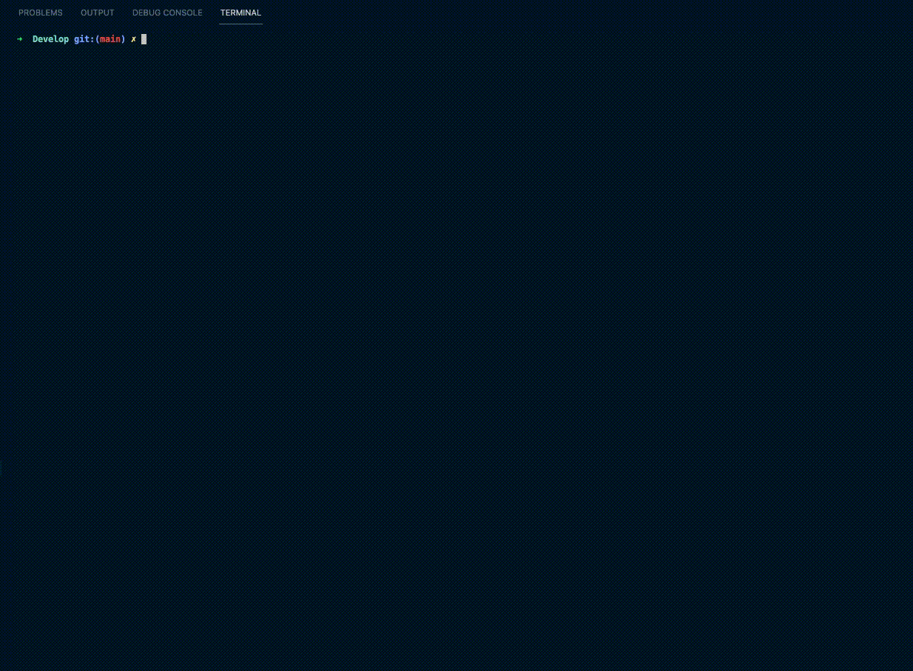

# E-Commerce Backend

## Description

I was tasked with building the backend for an e-commerce site by modifying starter code. This application utilizes a working Express.js API to make Sequelize interact with a MySQL database with tables for categories, products, tags, and product_tags.

## Table of Contents

- [Installation](#installation)
- [Usage](#usage)
- [License](#license)
- [Contributing](#contributing)
- [Testing](#testing)
- [Questions](#questions)

## Installation

Install the repository and run the following commands: `npm i` to install the dependencies, `mysql -u root -p` to initiate the SQL shell, `source ./db/schema.sql` within the SQL shell then `exit`, `npm run seed` to seed the database with test data, and `npm run start` to launch the site. From there you can test the endpoints with Insomnia.

You can see a live walk through of all the steps needed to initialize the app below:

## Usage

Because the project is not deployed on the web, you will have to follow the installation instructions to use it for yourself. You can also see live walk throughs of all the endpoints in Insomnia below:

GET all, GET one by ID, POST, PUT, and DELETE routes for Categories:

GET all, GET one by ID, POST, PUT, and DELETE routes for Products:

GET all, GET one by ID, POST, PUT, and DELETE routes for Tags:

## License

This application is covered under the MIT license.

## Contributing

Adhere to the contributing covenant.

## Testing

Testing has been performed using Insomnia.

## Questions

If you have any questions, please feel free to contact me via:

- Github: [chighum](https://github.com/chighum)
- Email: [chighum41@gmail.com](mailto:chighum41@gmail.com)
